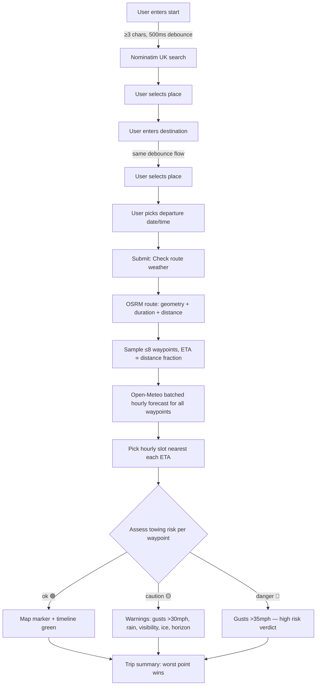
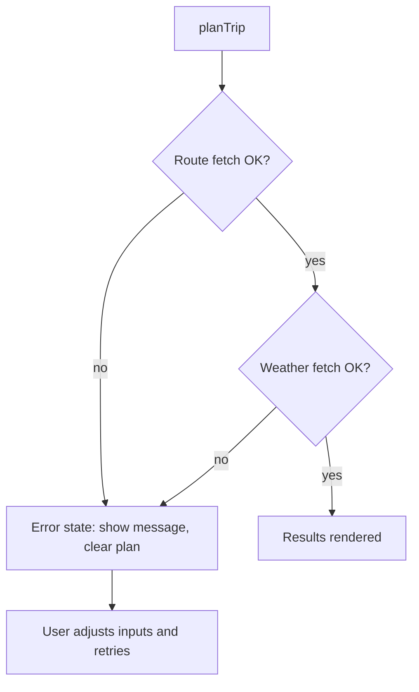
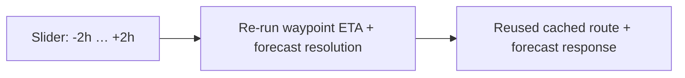

# App Workflows

Mermaid diagrams describing the main flows of Caravan Route Weather.

## Trip planning (primary workflow)

## Error handling

## Departure-time comparison (nice-to-have, not in V1)

